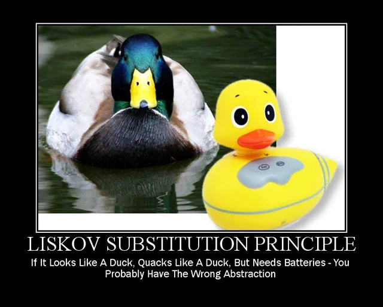

# Liskov Substitution Principle

Let's look at the **'L'** in SOLID, which is the 3rd design principle. 'L' stands for Liskov Substitution Principle. This is often abbreviated as LSP.

> It is named after a computer scientist. [Barbara Liskov](https://en.wikipedia.org/wiki/Barbara_Liskov) who explained this principle in a book that she authored. 

This principle states "Objects should be replaceable with their subtypes without affecting the correctness of the program".

To explain this, we will start with inheritance, which is a basic feature of any object oriented programming language.  Inheritance is also referred to as the 'Is-A' relationship.  

> e.g-1: A hatchback extends a car class. So we say hatchback **'is-a'** car. 

> e.g-2: We have a bird class, and ostrich extends bird. So Ostrich **'is-a'** bird.

On the face of it, all of this sounds perfect and sounds like text-book examples. But there are hidden problems with this approach, which may not seem obvious at first. 

In above two examples, the second one has a problem. Lets take that one alone and analyze further. So Ostrich is a bird. And by all means of real-world classification, an ostrich is a bird alright. As per the biological classification too, ostrich is a bird. But, heres an interesting fact, An ostrich cannot fly. 

Lets see this in code now. 

So, we have a Bird class with fly method.

```java
public class Bird {
  public void fly() {
    // fly high...
  }
}
```

Then, we have an Ostrich class that extends the Bird class.

```java 
public class Ostrich extends Bird {
  @override 
  public void fly() {
    // unimplemented
    throw new RuntimeException();
  }
}
```

Because the fly() method does not make sense for an Ostrich, what the Ostrich class does is, it overrides the fly method from the Bird class and leaves it unimplemented. 

> Unimplemented methods are almost always indicative of a design flaw. 

But if we apply the Liksov Principle here, which says: Objects should be replaceable with their subtypes without affecting the correctness of the program.
**This test fails**
> Because you cannot use an Ostrich object in all the places where you use the Bird object. If you do so, and someone calls the fly() method on the Bird object, your program will fail. 

So the Liskov Substitution Principle requires a test standard that is more strict than the 'is-a' test. It wants us to move away from the **'is-a' way of thinking**.

>This is a line often associated with the Liskov Substitution Principle: If it looks like a duck and quacks like a duck but it needs batteries, you probably have the wrong abstraction!



## Breaking the Hierarchy
- Example One 
Lets get started with the first example. We have a generic Car class and a Racing car.  
The Racing car extends car.  

Lets see what the code looks like now. 

```java
// Car Class
public class Car {
  public double getCabinWidth() {
    // return cabin width
  }
}

// RacingCar Class
public class RacingCar extends Car {

  @override
  public double getCabinWidth(){
    // unimplemented!!
  }

  public double getCockpitWidth() {
    // return cockpit width
  }
}
```
The Car class has one method getCabinWidth() that returns the cabin width of the car.  

The RacingCar class overrides the getCabinWidth() function and leaves it unimplemented.  

Why? Thats because racing cars have a set of specifications some of which might not match that of a generic car. 

> In a generic car, we call the width as cabin width. But in a racing car, there is no cabin. The interior space is called a cockpit.

So the racing car implements a getCockpitWidth() method accordingly.

Now, lets create some objects of Cars and RacingCars and play around with it. 

We will look at the following utils class.

```java
public class CarUtils {
  public static void main(String[] args) {
    Car fisrt = new Car();
    Car second = new Car();
    Car third = new RacingCar();

    List<Car> myCar = new ArrayList<>();
    myCar.add(first);
    myCar.add(second);
    myCar.add(third);
    
    for(Car car: myCars) {
      System.out.println(car.getCabinWidth);
    }
  }
}
```

So CarUtils instantiates 3 objects with reference Type Car.  

Note that even though the reference for all 3 objects is Car,two of them are generic's instances, the third one is a racing car instance. We insert all 3 car reference objects into an ArrayList and name it myCars. Next we iterate through the car list and we print out the cabinWidth of each car. 

For first two car object, the **getCabinWidth()** method works fine. But in the third iteration, the object is a RacingCar object. And RacingCar overrides the getCabinWidth() method and leaves it unimplemented. So in the third iterations, this code will not work correctly, because of an unimplemented method. 

>So this is the design hole that has been exposed. 

**So how do you fix this?**
We have to strike at the root, which is the inheritance itself. So we have to break the inheritance. 

RacingCar should no longer extend Car.

> Instead we'll come up with a common parent for both.  

So we create a new class called Vehicle which is a very generic class which can represent any modes of transportation including a truck, a boat, or an airplane. Then we make both Car and RacingCar extend this Vehicle class.  

We need to restructure the code also accordingly. 

Lets see how that can be done.  

First is the vehicle class, which has one method, called getInteriorWidth().

Note that it is neither cabin width nor cockpit width, but a much more generic abstraction called interior width. 

```java
public class Vehicle {
  public double getInteriorWidth() {
    // Return interior width
  }
}

public class Car extends Vehicle {
  @override
  public double getInteriorWidth() {
    return this.getCabinWidth();
  }

  public double getCabinWidth() {
    // Return the cabin width
  }
}

public class RacingCar extends Vehicle {
  @override
  public double getInteriorWidth() {
    return this.getCockpitWidth();
  }

  public double getCockpitWidth() {
    // Return the cockpit width
  }
}
```
In above example we have Car and RacingCar overrides the getInteriorWidth(), which inturn calls its **getCabinWidth()** and **getCockpitWidth()** respectively. 

So thats the code restructuring that is needed to follow the new hierarchy.

Finally, lets look at the same CarUtils class again. You can renamed it to VehicleUtils by the way. 

```java
public class VehicleUtils {
  public static void main(String[] args) {
    Vehicle fisrt = new Car();
    Vehicle second = new Car();
    Vehicle third = new RacingCar();

    List<Vehicle> myCar = new ArrayList<>();
    myCar.add(first);
    myCar.add(second);
    myCar.add(third);
    
    for(Vehicle car: myCars) {
      System.out.println(car.getCabinWidth);
    }
  }
}
```

Again, we have the first two car objects and the third RacingCar object. Note that all 3 are of reference type Vehicle. 

> First two iterations, the getInteriorWidth() method gets called on the car objects. The Car objects, in turn,call their getCabinWidth method. In the third and last iteration, the getInteriorWidth() method gets called on the RacingCar objects, which in turn, call their getCockpitWidth method. So all calls work correctly. And the whole thing is dynamic.

So the solution that we applied to this pattern of problems is called **'Breaking the hierarchy'**. 

There is one more pattern where we apply the Liskov Substitution Principle in a different way. 

## Tell, Don't Ask
Here we are going to look at a second example for applying the Liskov Substitution Principle in a different way.

We have a generic Product class. We also have an InHouseProduct class that extends the Generic Product class.  

Just think of it from the perspective of an e-commerce website like Amazon.

Amazon sells a number of products on its website, mostly from third party sellers. But Amazon has its own set of products too, which they manufacture InHouse. I think they call the brand line as Amazon Basics. So thats what I mean by InHouseProducts. 

Assume ,all Products get a base discount of 20%. But, if its an In-House Product, it gets 1.5 times the existing base discount. So if the base discount is 20%,
then an InHouse Product will get 1.5 times 20 which is a 30% discount.

This is the hierarchy that we need to implement.

Lets start with initial version. 

```java
public class Product {
  protected double discount;

  protected double getDiscount() {
    return discount;
  }
}

public class InHouseProduct extends Product {
  public void applyExtraDiscount() {
    discount *= 1.5;
  }
}
```
Note that the InHouseProduct does NOT override the getDiscount() method, so it will simply inherit the getDiscount() method from its parent, the Product class.  

We will now use a bunch of these product and InHouseProduct objects in another class. This class is named PricingUtils.

```java
public class PricingUtils {
  public static void main(String[] args) {
    Product p1 = new Product();
    Product p2 = new Product();
    Product p3 = new InHouseProduct();

    List<Product> productList =  new ArrayList<>();
    productList.add(p1);
    productList.add(p2);
    productList.add(p3);

    for(Product product: productList){
      if(product instanceof InHouseProduct){
        ((InHouseProduct) product).applyExtraDiscount();
      }

      System.out.println(product.getDiscount());
    }
  }
}
```
What we are seeing now in this Utils class, is NOT a good design. This is against the Liskov Substitution Principle.  

We should have been able to deal with all the objects as Product objects itself instead of typecasting to InHouseProduct for some of them. 

**So how do you fix this?**
```java
public class InHouseProduct extends Product {
  @override
  public double getDiscount() {
    this.applyExtraDiscount();
    return discount;
  }

  public void applyExtraDiscount() {
    discount *= 1.5;
  }
}
```

The overridden getDiscount() method, in turn, will call the applyExtraDiscount() method. 

Now, we'll do the corresponding change in PricingUtils.NO change to the product instantiations. That part remains the same. The only difference is that the instanceof check is now gone. 

```java
public class PricingUtils {
  public static void main(String[] args) {
    Product p1 = new Product();
    Product p2 = new Product();
    Product p3 = new InHouseProduct();

    List<Product> productList =  new ArrayList<>();
    productList.add(p1);
    productList.add(p2);
    productList.add(p3);

    for(Product product: productList){
      System.out.println(product.getDiscount());
    }
  }
}
```
We do not need to bother if the objects are instances of Generic Product or instances of InHOuseProduct. By doing this, the Liskov substitution test gets passed now. 

So objects can be substituted by their subtypes without affecting the correctness of the program, in this particular example.

The solution to this pattern is called **'Tell, Don't Ask'**.

Here, in second example the solution is to restructure the code, so as to follow the 'Tell, don't ask' rule.

## Solutions 
1. Break the hierarchy if it fails the substitution test.

2. Restructure the code, so as to follow the 'Tell, don't ask' rule.

## Summing-Up
- we need to move away from the **'Is-A'** way of thinking. The toy duck that runs on a battery might not belong to the duck hierarchy even though it **Is-A** duck. 

- First pattern of problem as in example 1 is to **break the hierarchy** and then in second pattern as in example 2, which can be solved by **Tell, Don't ask**.
 