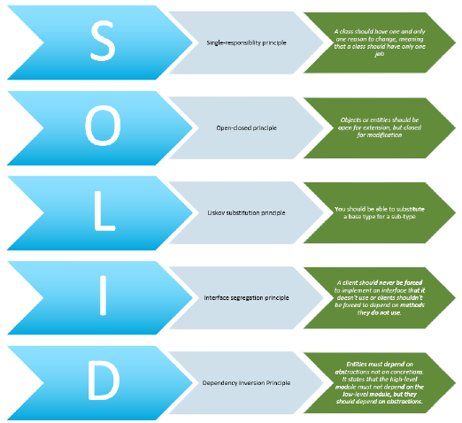

# SOLID

Learning SOLID Principles and to write clean and well-designed code in Object Oriented Languages.

These principles establish practices that lend to developing software with considerations for maintaining and extending as the project grows. Adopting these practices can also contribute to avoiding code smells, refactoring code, and Agile or Adaptive software development.

SOLID stands for:

- S - Single Responsibility Principle
- O - Open-Closed Principle
- L - Liskov Substitution Principle
- I - Interface Segregation Principle
- D - Dependency Inversion Principle

---

## Table of Content
[1. Single Responsibility Principle](./SolidPrinciple)
  - Cohesion
  - Coupling
  - Reason for change
  - Code example
   